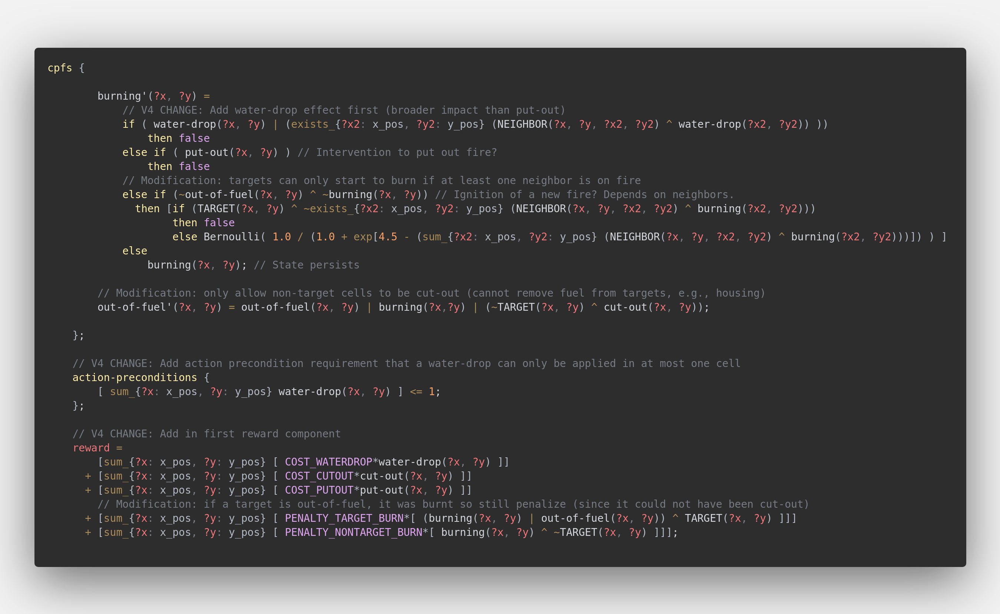

## RDDL syntax highlighting for VS Code

Syntax highlighting for the [Relational Dynamic Influence Diagram Language](https://github.com/ssanner/rddlsim) (RDDL) in Visual Studio Code.



### Getting started
These instructions will get you a copy of this project up and running on your local machine for usage, development or testing purposes.

1) Clone the repository or download and extract the ZIP files:  
  ```
  git clone <SSH or HTTPS>
  ```
2) Move the cloned repository under the .vscode folder of your system's home directory (Linux):
  ```
  mv vscode-rddl/ ~/.vscode/extensions/  
  ```
3) Launch VS Code or reload your current window for these changes to take effect.

4) Finally, select RDDL in the bottom right corner of VS Code's status bar and you are ready to go!

### Tested with:
* Ubuntu 18.04
* VS Code 1.43.2
* [New Moon](https://taniarascia.github.io/new-moon/) (color theme)

### Authors:
See the list of [contributors](https://github.com/MartijnCramer/vscode-rddl/contributors) who participated in this project.

### License
This project is licensed under the MIT License - see the [LICENSE](LICENSE) file for more details.

### Acknowledgments
* [KU Leuven](https://iiw.kuleuven.be/english/diepenbeek) @ Diepenbeek Campus
* Automation, Computer vision and Robotics ([ACRO](https://iiw.kuleuven.be/onderzoek/acro)) research unit
